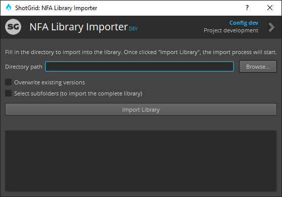

# ShotGrid Library Importer App
This desktop app will provide a GUI to import a complete stock library.
It will create an asset grouped per scene, transcode with FFMPEG a preview for ShotGrid, and create a version for every asset.

